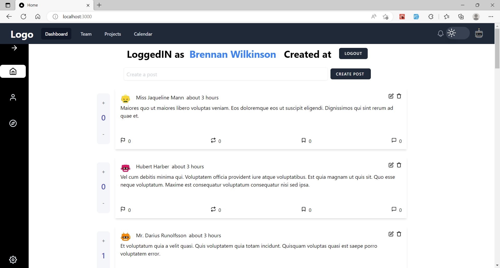
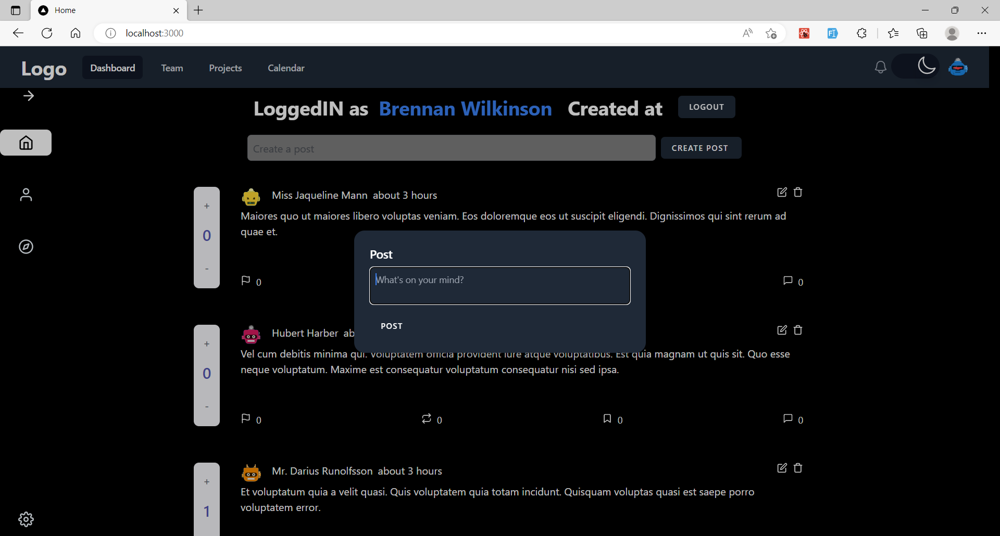
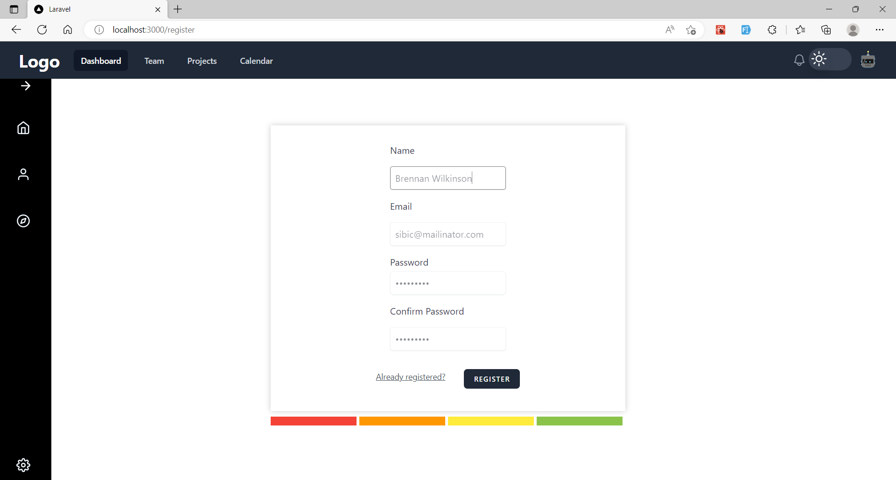
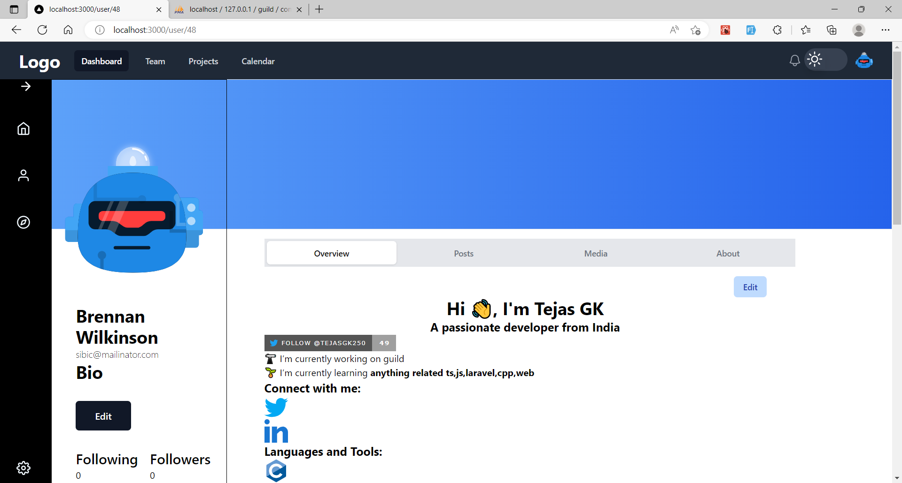
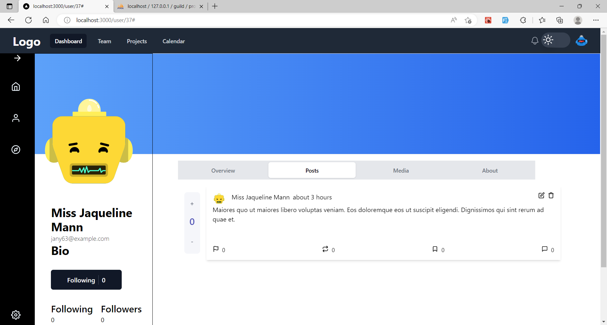
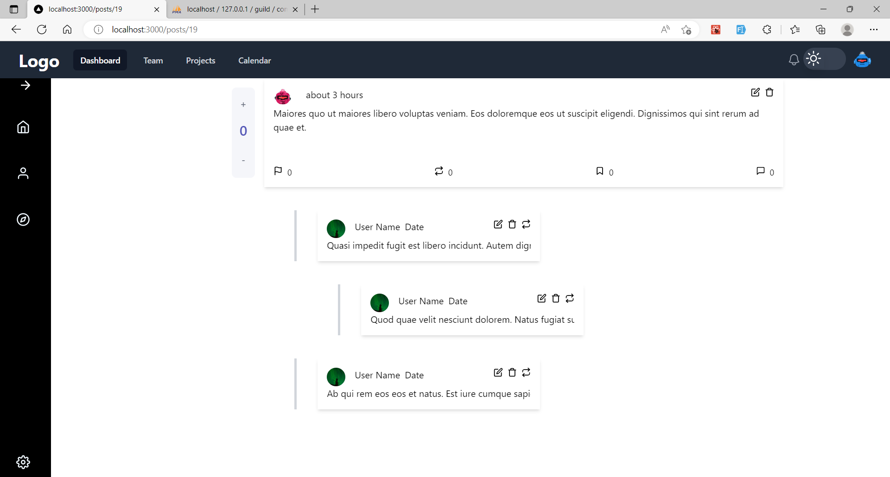

# Guild
A social media platform for everyone.
 
Table of contents
=================
 
  * [Guild](#guild)
    * [Table of contents](#table-of-contents)
    * [Introduction](#introduction)
    * [Tech](#tech)
    * [Screenshots](#screenshots)
    * [Installation](#steps)
      * [Requirements](#requirements)
      * [Installation](#steps)
    * [Contributing](#contributing)

## Introduction

* back to [Table of contents](#table-of-contents)
## Tech
- nextjs
- laravel
- typescript
- swr
- phpunit
- tailwind
* back to [Table of contents](#table-of-contents)

## Screenshots






* back to [Table of contents](#table-of-contents)


## Requirements
- [ ] composer
- [ ] node
- [ ] xampp
- [ ] mailtrap or similar

* back to [Table of contents](#table-of-contents)

## steps
```
- turn on xampp
- git clone this repo
- add envs
- cd server && composer install
- php artisan key:generate
- php artisan migrate:fresh --seed
- php artisan serve
- cd client && npm i
- npm run dev
- ./vendor/bin/pint
- npm run lint
```

* back to [Table of contents](#table-of-contents)

###### I use this repo for shaktipradarshana
